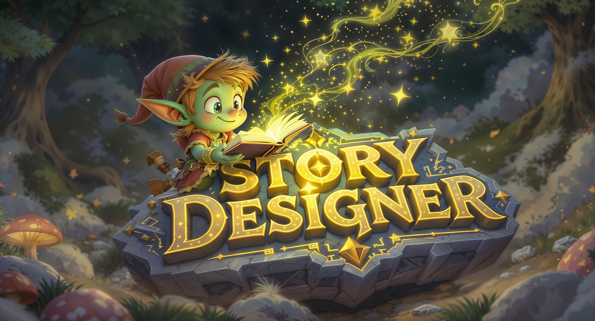

# StoryDesigner

An interactive story creation platform that combines traditional storytelling with AI-powered assistance and community collaboration. Built with SvelteKit 5 and Supabase.

## Features

- **Interactive Story Editor** - Create rich, multimedia stories with scenes, events, and dynamic content
- **AI Integration** - Multiple AI services including FAL.ai image generation and AI notebook assistance
- **Community Platform** - Share stories, discover templates, and engage with other creators
- **Real-time Collaboration** - WebSocket-based AI story interface for collaborative creation
- **Mindmap Visualization** - Visual story structure using Cytoscape.js
- **Template Marketplace** - Community-driven templates and assets

For more details [view the roadmap](./ROADMAP.md)
